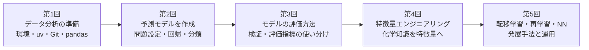

# データサイエンス勉強会

製薬企業の化学分野の研究者を対象にした、全5回の機械学習ハンズオン勉強会です。各回は長め・自己完結で、1回で全部を終える必要はありません。

## この勉強会が目指すもの

**今の姿（AS-IS）**

化学・創薬分野の実験や研究には詳しいが、Pythonや機械学習はほぼ未経験。モデルは「作れれば十分」だと思いがちで、評価の妥当性（データリーク・過学習）を疑う習慣がない。Python環境やバージョン管理といった、開発の基礎的な道具にも触れたことがない。

**目指す姿（TO-BE）**

1. Python環境・uv・Git・pandasといった、今後の分析でも使える開発習慣が身についている
2. 何を・いつ予測するかを自分で決め、scikit-learnで回帰・分類のモデルを作れる
3. 回帰・分類それぞれの評価方法を理解し、Logloss・AUCなどの指標を使い分けて、自分の作ったモデルを正しく評価できる
4. 化学知識を特徴量に変換し、モデルへ渡せる形にできる
5. ニューラルネットワーク・転移学習の可能性と限界を知り、モデルを運用（監視・再学習）まで見据えられる

全5回は、この**5つの力を1回に1つずつ積み上げていく**構成です。


教材と進行は日本語を基本にします。外部の英語公式ドキュメントは、講師が必要箇所を確認するための参考資料として扱います。概念は文章だけでなく、図、Notebookの出力、身近な化学研究の例を組み合わせて説明します。

## なぜこの5回の流れなのか



道具をそろえてから作り、作ったら正しく評価し、評価できるようになってから改善（特徴量）に進み、
最後に発展的な手法と運用を知る、という積み上げの順番です。詳しい時間配分やパート構成は
[全5回の進め方](docs/course-plan.md)を参照してください。

## この教材の使い方

読む順番の目安と、各資料が何のためにあるかをまとめます。目標に近づく順に、「知る→整える→進める→深める」の4段階です。

**1. 知る：全体像を知る**

- このREADME：目指す姿と全5回の位置づけ
- [全5回の進め方](docs/course-plan.md)：各パートの時間配分・深掘り内容まで含めた詳細
- [講師用進行ガイド](docs/instructor-guide.md)：講師向けの進行メモ（受講者は読まなくてOK）

**2. 整える：自分のPCで動かせるようにする**

- 下の「ローカル環境」（このページ内）：最短手順
- [Windows環境の準備](docs/setup-windows.md)：もう少し詳しい手順とトラブルシューティング
- [Python環境とGitの基礎（任意）](docs/environment-and-git-basics.md)：環境やGitの仕組みをもっと知りたい人向け

**3. 進める：各回の教材を実際に動かす**

- [各回の教材](lessons/)：全5回のNotebookとREADME
- [教材データの説明](data/README.md)：使う化学データの列の意味
- [M365 Copilotと一緒にコードを書く](docs/copilot-guide.md)：分からないコードをCopilotへ相談する方法

**4. 深める：興味に応じて追加で触る（任意）**

- [各回で使う既存教材候補](docs/resources.md)：外部教材へのリンク集
- [Kaggle Titanic 日本語ガイド](docs/kaggle-titanic-guide.md)：第5回に置いてある任意のKaggle実践教材

## リポジトリの構成

学習者が実際に触るのは、次の4つのフォルダです。何のために分かれているのかも書いておきます。

- **`lessons/`**：各回の教材原本（Notebookと進め方のREADME）。全5回が1回1フォルダで独立しているので、途中の回だけを見ても迷いません。ここは配布されたままの状態を保つ場所で、直接編集はしません。
- **`workspace/`**：自分の作業場所。`lessons/`のNotebookをコピーしてから、ここで編集・実行します。原本と自分の作業を分けておくことで、教材が更新されても自分の変更が消えず、逆に自分の試行錯誤で原本を壊す心配もありません。
- **`data/`**：この勉強会で使う化学データ（合成データ）。実在の自社データではなく、安全に練習できるように作られたデータです。
- **`docs/`**：進め方・環境準備・Copilotの使い方などのガイド類。実習中に迷ったとき立ち返る参照資料です（上の「この教材の使い方」から個別にリンクしています）。

上記以外（`scripts/`や`pyproject.toml`など）は教材を生成・検証するための裏方で、学習者が直接触る必要はありません。

## ローカル環境

Windows、VS Code、`uv`を標準環境とします。GitHubアカウントとGitのインストールは不要です。それぞれ何なのかを簡単に説明します。

- **Windows**：このパソコンを動かしている基本のソフト（OS）です。普段使っているパソコンそのものだと考えて構いません。
- **VS Code**：プログラムのコードを書いたり編集したりするための無料アプリです。Microsoftが作っていて、文章を書くときのメモ帳やWordのような役割を、プログラミング用に強化したものです。
- **uv**：Pythonの実行環境と、必要な部品（ライブラリ）を自動でそろえてくれる道具です。誰のパソコンで実行しても同じ結果になるように、環境を統一する役目を持ちます。

この教材のNotebookを自分のパソコンで動かせるようにするため、最初に一度だけ次の準備をします（一度実行すれば、以降は繰り返す必要はありません）。

1. GitHub画面右上の緑色の`Code`を押す
2. `Download ZIP`を選ぶ
3. ZIPを展開し、展開したフォルダ（`pyproject.toml`があるフォルダ）をVS Codeで開く
4. メニューの「ターミナル」→「新しいターミナル」でターミナルを開く（手順3で開いたフォルダが自動的に実行場所になるので、`cd`でフォルダを移動する必要はありません）
5. ターミナルで次を実行する

```powershell
uv sync
uv run python scripts/check_environment.py
uv pip install ipykernel
ipython kernel install --user --name=kernel-name
```

Notebookをブラウザで開く場合は、次を実行します。

```powershell
uv run jupyter lab
```

VS Codeで`lesson.ipynb`のようなNotebookファイルを開くと、画面右上に「カーネルの選択」というボタンが表示されます。カーネルとは、そのNotebookのコードを実際に動かすPython本体のことです。ここで、先ほどの`uv sync`によって用意された `.venv\Scripts\python.exe` を選んでください。これを選ばないと、この教材に必要な部品（ライブラリ）が入っていない別のPythonでコードが実行され、エラーになることがあります。

各回のフォルダにある`lesson.ipynb`を`workspace`へコピーし、コピーした方を上から順に実行します。

## Notebookの進め方

各Notebookは「説明 → コード → 出力の読み方」の順に進みます。初めて出るAPIや用語は、
使うセルで説明します。最初に専門用語を覚える必要はありません。

まず「基本」と「演習」を上から順に進めてください。「補足」は必要に応じて読みます。
「発展（任意）」「追加演習（任意）」「自由課題（任意）」は経験者や自習向けなので、
初学者は飛ばして構いません。一部でXGBoostやOptunaを使う場合だけ、`uv sync --extra advanced`を実行します。

## 図の読み方

- 雰囲気や全体像をつかむ場面では、オリジナルのイラストを使います
- 手順や用語を正確に区別する場面では、日本語ラベル付きの図を使います
- 図だけで結論を決めず、実際のデータとNotebookの結果で確かめます

## 全5回とその位置づけ

各回は**パート1〜3**（第1回のみパート4まで）で構成されます。「フォルダ」を押すと、その回の教材（`README.md`と`lesson.ipynb`）へ直接移動できます。

| 回 | テーマ | この回の位置づけ | 含むパート | フォルダ | Notebook |
|---:|---|---|---|---|---|
| 1 | データ分析の準備 | 開発習慣（環境・uv・Git・pandas）の土台を作る | 環境とuv・Git／Python基礎／pandas／EDA | [01-prepare-and-explore](lessons/01-prepare-and-explore/) | [開く](lessons/01-prepare-and-explore/lesson.ipynb) |
| 2 | 予測モデルを作成 | 問題設定を決め、回帰・分類のモデルを作る技術を身につける | 問題設定／回帰／モデル比較 | [02-build-models](lessons/02-build-models/) | [開く](lessons/02-build-models/lesson.ipynb) |
| 3 | モデルの評価方法 | 作ったモデルを正しく検証し、評価指標を使い分ける | 検証・リーク／分類の評価／改善実験 | [03-evaluate-models](lessons/03-evaluate-models/) | [開く](lessons/03-evaluate-models/lesson.ipynb) |
| 4 | 特徴量エンジニアリングの紹介 | 化学知識を特徴量に変え、安全に選ぶ | Pipeline化／特徴量を作る／特徴量を選ぶ | [04-feature-engineering](lessons/04-feature-engineering/) | [開く](lessons/04-feature-engineering/lesson.ipynb) |
| 5 | 転移学習・再学習・ニューラルネットワークモデルの紹介 | 発展的な手法を知り、運用まで見据える | ニューラルネットワーク／転移学習／運用（永続化・監視・再学習） | [05-advanced-and-operate](lessons/05-advanced-and-operate/) | [開く](lessons/05-advanced-and-operate/lesson.ipynb) |

## 公開リポジトリのルール

このリポジトリには、公開・再配布可能なデータ、合成データ、独自に作成したコード、外部教材へのリンクだけを置きます。自社データ、社内限定資料、実在プロジェクトを推測できる情報、購入教材の転載は置きません。
