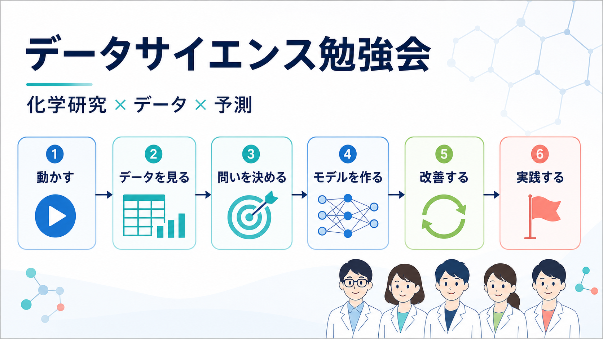

# データサイエンス勉強会

製薬企業の化学分野の研究者を対象に、予測モデルを「作って終わり」ではなく、意図を持って評価・改善できるようになることを目指す、全15回の勉強会です。

講義だけでなく、毎回Pythonコードを動かし、結果の違いや失敗を全体で共有します。自習は任意です。同期だけでも次へ進めるよう、Notebookには共通課題と発展課題を用意します。



教材と進行は日本語を基本にします。外部の英語公式ドキュメントは、講師が必要箇所を確認するための参考資料として扱います。概念は文章だけでなく、図、Notebookの出力、身近な化学研究の例を組み合わせて説明します。

## まず見る場所

- [全15回の進め方](docs/course-plan.md)
- [各回で使う既存教材候補](docs/resources.md)
- [Windows環境の準備](docs/setup-windows.md)
- [M365 Copilotと一緒にコードを書く](docs/copilot-guide.md)
- [講師用進行ガイド](docs/instructor-guide.md)
- [Kaggle Titanic 日本語ガイド](docs/kaggle-titanic-guide.md)
- [各回の教材](lessons/)
- [教材データの説明](data/README.md)

## ローカル環境

Windows、VS Code、`uv`を標準環境とします。GitHubアカウントとGitのインストールは不要です。それぞれ何なのかを簡単に説明します。

- **Windows**：このパソコンを動かしている基本のソフト（OS）です。普段使っているパソコンそのものだと考えて構いません。
- **VS Code**：プログラムのコードを書いたり編集したりするための無料アプリです。Microsoftが作っていて、文章を書くときのメモ帳やWordのような役割を、プログラミング用に強化したものです。
- **uv**：Pythonの実行環境と、必要な部品（ライブラリ）を自動でそろえてくれる道具です。誰のパソコンで実行しても同じ結果になるように、環境を統一する役目を持ちます。

この教材のNotebookを自分のパソコンで動かせるようにするため、最初に一度だけ次の準備をします（一度実行すれば、以降は繰り返す必要はありません）。

1. GitHub画面右上の緑色の`Code`を押す
2. `Download ZIP`を選ぶ
3. ZIPを展開し、展開したフォルダをVS Codeで開く
4. VS Codeのターミナルで次を実行する

```powershell
uv sync
uv run python scripts/check_environment.py
```

Notebookをブラウザで開く場合は、次を実行します。

```powershell
uv run jupyter lab
```

VS Codeで`lesson.ipynb`のようなNotebookファイルを開くと、画面右上に「カーネルの選択」というボタンが表示されます。カーネルとは、そのNotebookのコードを実際に動かすPython本体のことです。ここで、先ほどの`uv sync`によって用意された `.venv\Scripts\python.exe` を選んでください。これを選ばないと、この教材に必要な部品（ライブラリ）が入っていない別のPythonでコードが実行され、エラーになることがあります。

各回のフォルダにある`lesson.ipynb`を`workspace`へコピーし、コピーした方を上から順に実行します。

## Notebookの目印

- `CORE`：同期90分で扱う本線
- `CORE深掘り`：CORE本線に続く、全員向けの少し踏み込んだ内容
- `TRY`：全員で試す
- `CHANGE`：値や列を少し変更する
- `CHALLENGE`：興味のある人向けの自由研究
- `DEEP DIVE`：同じ題材を一段深く調べる追加実験
- `APPENDIX（任意・追加演習）`：90分の外で手を動かす、重めの追加コード
- `SELF-STUDY`：任意の30～60分自習
- `ASK COPILOT`：M365 Copilotへ相談してみる

各Notebookは、初学者が独りでも読み進められるよう、**コードセルごとに解説を挟む**構成です。
おおむね「これから何をするか → コード → 出力の読み方・つまずきポイント」の順に並び、
`train_test_split`や`fit`/`predict`のような初出のAPIは、その場で日本語で説明します。
学習目標、重要用語、実行前の予想、`CORE`の本線と`CORE深掘り`、複数セルの`DEEP DIVE`、
任意の`APPENDIX`、よくある誤り、任意自習、振り返りの3問も収録しています。
`CORE`でも関数化・交差検証・ベースライン比較まで踏み込み、`DEEP DIVE`では
学習曲線・ネストした交差検証・確率の較正・スタッキング・特徴量選択など、
評価の厳密さとモデルの多様さを一段深く扱います。
初学者は`CORE`と`TRY`を優先し、経験者は同じNotebookの`CORE深掘り`・`DEEP DIVE`・`APPENDIX`へ進みます。

`APPENDIX`は90分の同期回では扱いません。時間の制約でCOREを絞っている分を、自習で手を動かして
深められるように用意した任意の追加コードです（飛ばしても本編は完結します）。
一部の`DEEP DIVE`／`APPENDIX`はXGBoostやOptunaを任意で使えますが、未導入でもscikit-learnだけで
最後まで実行できます。使いたい人だけ `uv sync --extra advanced` を実行します。

## 図の読み方

- 雰囲気や全体像をつかむ場面では、オリジナルのイラストを使います
- 手順や用語を正確に区別する場面では、日本語ラベル付きの図を使います
- 図だけで結論を決めず、実際のデータとNotebookの結果で確かめます

## 全15回

各回の「フォルダ」を押すと、その回の教材（`README.md`と`lesson.ipynb`）へ直接移動できます。

| 回 | テーマ | フォルダ | Notebook |
|---:|---|---|---|
| 1 | 予測モデルを動かしてみる | [01-kickoff](lessons/01-kickoff/) | [開く](lessons/01-kickoff/lesson.ipynb) |
| 2 | Pythonを読み、Copilotと少し変える | [02-python-with-copilot](lessons/02-python-with-copilot/) | [開く](lessons/02-python-with-copilot/lesson.ipynb) |
| 3 | pandasで表データに触る | [03-pandas](lessons/03-pandas/) | [開く](lessons/03-pandas/lesson.ipynb) |
| 4 | データ探偵—分布・欠損・外れ値 | [04-eda](lessons/04-eda/) | [開く](lessons/04-eda/lesson.ipynb) |
| 5 | 何を、いつ、何のために予測するか | [05-problem-framing](lessons/05-problem-framing/) | [開く](lessons/05-problem-framing/lesson.ipynb) |
| 6 | モデルは本当に当たっているか | [06-validation-leakage](lessons/06-validation-leakage/) | [開く](lessons/06-validation-leakage/lesson.ipynb) |
| 7 | 数値を予測する：回帰 | [07-regression](lessons/07-regression/) | [開く](lessons/07-regression/lesson.ipynb) |
| 8 | クラスを予測する：分類 | [08-classification](lessons/08-classification/) | [開く](lessons/08-classification/lesson.ipynb) |
| 9 | 前処理をPipelineにまとめる | [09-preprocessing-pipeline](lessons/09-preprocessing-pipeline/) | [開く](lessons/09-preprocessing-pipeline/lesson.ipynb) |
| 10 | モデル対決：線形モデル・木・アンサンブル | [10-model-comparison](lessons/10-model-comparison/) | [開く](lessons/10-model-comparison/lesson.ipynb) |
| 11 | 化学の知識を特徴量にする | [11-feature-engineering](lessons/11-feature-engineering/) | [開く](lessons/11-feature-engineering/lesson.ipynb) |
| 12 | 改善実験を小さく回す | [12-experiment-cycle](lessons/12-experiment-cycle/) | [開く](lessons/12-experiment-cycle/lesson.ipynb) |
| 13 | Kaggleに入って最初の提出を作る | [13-kaggle-kickoff](lessons/13-kaggle-kickoff/) | [開く](lessons/13-kaggle-kickoff/lesson.ipynb) |
| 14 | Kaggle改善会 | [14-kaggle-improvement](lessons/14-kaggle-improvement/) | [開く](lessons/14-kaggle-improvement/lesson.ipynb) |
| 15 | Show & Tellと自社データへの橋渡し | [15-show-and-tell](lessons/15-show-and-tell/) | [開く](lessons/15-show-and-tell/lesson.ipynb) |

## 公開リポジトリのルール

このリポジトリには、公開・再配布可能なデータ、合成データ、独自に作成したコード、外部教材へのリンクだけを置きます。自社データ、社内限定資料、実在プロジェクトを推測できる情報、購入教材の転載は置きません。
