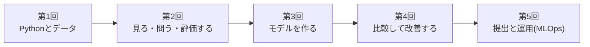
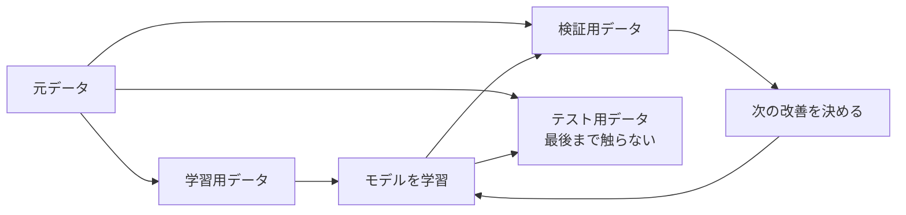
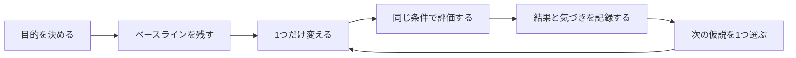

# 全5回の進め方

`CORE`や`DEEP DIVE`などの記号の意味は、[README「Notebookの目印」](../README.md#notebookの目印)で説明しています。

## この勉強会で大切にすること

- 毎回、説明より先に何かを動かす
- 正解より「何を変えたら何が起きたか」を話す
- 初心者はスターターコードを変更し、経験者は別案を試す
- 本線の`CORE`でも、関数にまとめる・検証方法を工夫する・何もしないモデルと比べる、といった実践的な内容まで扱う。`DEEP DIVE`ではさらに、評価の厳密さとモデルの多様さを深める（用語は各回で説明します）
- 自習していない週があっても、次回から普通に参加できる
- アルゴリズムの暗記より、予測時点・評価・比較・失敗例を大切にする
- M365 Copilotは、説明、変更、デバッグ、レビューの相棒として毎回使う

## 全5回とその内訳

旧カリキュラム15回を、3回分ずつ1回にまとめた**全5回**です（各回は長め・自己完結）。各回は**パート**に分かれます。

| 回 | テーマ | パート（旧「回」に相当） |
|---:|---|---|
| 1 | Pythonとデータに触れ、まず予測を動かす | 予測を動かす／Python／pandas |
| 2 | データを見て、問いを立て、評価を設計する | EDA／問題設定／検証・リーク |
| 3 | 回帰・分類・前処理Pipelineでモデルを作る | 回帰／分類／Pipeline |
| 4 | モデルを比較し、特徴量と実験で改善する | モデル比較／特徴量／実験サイクル |
| 5 | 提出から運用・監視・再学習（MLOps）へ | 模擬コンペ提出／改善会／Show&Tell／**MLOps** |

前半でコードとデータに慣れ、中盤で「評価できるモデル」を作り、後半で改善・実践・運用へ進みます。1回で全パートを終える必要はなく、パート単位で数回に分けて進めても構いません。

「各回の詳細」は、各回をパートごとに説明します。次の「各回で追加する深掘り」の表は、**行1つが1パート**に対応します（旧カリキュラムの15回＝現在の全パートで、例えば旧「第7回：回帰」＝現在の第3回パート1です）。

## 1パート（90分）の基本形

各回は3パート（第5回は4パート）あるため、実際には**1パートを1コマ（約90分）**として、複数コマに分けて進めます。下表は1パート分の基本形です。

| 時間 | 内容 |
|---:|---|
| 10分 | 前パートの面白かった結果を振り返る |
| 15分 | このパートの問いを共有する |
| 20分 | 講師のライブ実演 |
| 30分 | `TRY`と`CHANGE`を試す |
| 10分 | 参加者の結果を並べて話す |
| 5分 | 次パート予告と任意の`CHALLENGE` |

## 教材の深さを4層に分ける

同期回を90分に収めつつ内容を深めるため、各Notebookを次の4層に分けます。各コードセルには
「これから何をするか→コード→出力の読み方」の解説を付け、初学者が独りでも読み進められるようにします。

| 層 | 位置づけ | 目安 | 参加者の選び方 |
|---|---|---:|---|
| `CORE` / `TRY` | その回の本線 | 同期90分 | 全員で同じ出力まで進む |
| `CHANGE` / `DEEP DIVE` | 結果の解釈と追加実験 | 同期回の余り時間または任意30分 | 初学者は1つ、経験者は複数試す |
| `APPENDIX（任意・追加演習）` | 90分の外で手を動かす重めの追加コード | 任意30～90分 | もっとコードを書きたい人だけ |
| `CHALLENGE` / `SELF-STUDY` | 別条件・自社テーマへの転用 | 任意30～60分 | 興味のあるものだけ選ぶ |

`APPENDIX`は同期90分では扱いません。90分の制約でCOREを絞っている分を、自習で手を動かして深められる
ように各回へ用意した任意のコード群です（飛ばしても本編は完結します）。全員が全セルを終えることは
目標にしません。ただし、深掘りを選んだ人も「予想・変更点・出力・解釈」の4点を残し、
コード量だけで進捗を判断しないようにします。

## 各回で追加する深掘り

この表は経験者向けの発展メニューの一覧なので、専門用語が多く登場します。分からない言葉があっても心配ありません。実際に扱う回のNotebook内で、そのつど説明します。

「パート」列は旧カリキュラムの第1回〜第15回に対応し、上から順に第1回パート1・2・3、第2回パート1・2・3…と続きます。

| パート | 同期回の本線（CORE） | 一段深い実験・考察（CORE深掘り／DEEP DIVE） |
|---:|---|---|
| 1 | ベースライン比較と1試料の予測、評価の関数化 | 学習/検証F1の交差検証曲線、不純度対並べ替え重要度、確率の較正 |
| 2 | 型ヒント・docstring付き関数を読み書きする | 防御的関数、assertテスト、IQR外れ値除去、冪等性の調査 |
| 3 | 健康診断・`query`・`groupby`で集計 | `pivot_table`、`pipe`、apply対ベクトル化の速度比較 |
| 4 | 分布・欠損・外れ値を可視化 | 相関対相互情報量、欠損機構（MCAR/MAR）、`IsolationForest`の多変量外れ値 |
| 5 | 予測問題とDummyを定義、リーク監査関数 | コスト行列と期待コスト最小の閾値、指標を意思決定から逆算 |
| 6 | 前処理を分割の内側へ、系列分割 | KFold/Stratified/Group比較、ネストCV、adversarial validation |
| 7 | 回帰4モデルを交差検証で比較 | 学習曲線、群別残差、分位点回帰の予測区間と被覆率 |
| 8 | 混同行列・閾値・PR-AUC | 確率の較正（信頼度図・Brier）、コスト最適閾値、`class_weight` |
| 9 | 前処理をPipeline化、変換後の列名確認 | 自作変換器（`BaseEstimator`）、前処理の`GridSearchCV`探索 |
| 10 | 5モデルを同条件・交差検証で比較 | 反復CVとWilcoxon検定、投票・スタッキング、任意でXGBoost |
| 11 | 仮説特徴量の交差検証アブレーション、相互情報量選択 | リーク安全なOOF target encoding、`RFECV`による特徴量選択 |
| 12 | 1要素ずつ改善を記録 | `RandomizedSearchCV`、ネストCVの楽観の少ない推定、重要度の信頼区間 |
| 13 | ベースライン提出とassert検査 | OOF予測でCV-LB確認、テスト付き提出バリデータ |
| 14 | 分担して改善案を比較 | OOFスタッキング、adversarial validation、シードアンサンブル |
| 15 | 結果と次の一歩を共有、1枚シート | `joblib`永続化、モデルカード生成関数、近傍距離の適用領域 |

右列は全員必修ではありません。講師は参加者の反応を見て1〜2個だけ同期回で扱い、残りを任意自習へ回します。`CORE深掘り`は本線に近く全員向け、`DEEP DIVE`は経験者や自習向けです。

## 各回の詳細

### 第1回：Pythonとデータに触れ、まず予測を動かす

#### パート1：予測モデルを動かしてみる

**今日の問い**：予測モデルは、データを受け取って何を返しているのか。

- GitHubのREADME、フォルダ、履歴を見る
- ZIP展開、`uv sync`、環境チェックを行う
- 完成済みの分類モデルで予測する
- 入力値やモデルの設定を1つ変え、結果の違いを見る
- 「学習」「予測」「特徴量」「目的変数」の言葉を体験と結びつける

経験者は、別モデルへ差し替えたり、`random_state`を変えたりします。

#### パート2：Pythonを読み、Copilotと少し変える

**今日の問い**：分からないコードを、どうやって小さく理解するか。

- 変数、リスト、辞書、`if`、`for`、関数、`import`を読む
- Notebookの実行順と変数の状態を確認する
- Copilotにコードを行ごとに説明させる
- 既存コードを壊さず、変更を1つだけ依頼する
- エラー全文を渡して、原因候補と最小修正を聞く

文法を網羅せず、以後の分析で頻繁に現れる形へ絞ります。

#### パート3：pandasで表データに触る

**今日の問い**：初めて見る表データを受け取ったら、最初に何を見るか。

- CSVを`DataFrame`として読み込む
- `head`、`shape`、`dtypes`、`describe`を使う
- 行と列を選択する
- 条件で絞り込み、集計する
- データ型と欠損値を確認する

5人がそれぞれ違う列を担当し、「この列は何を表していそうか」を共有します。

### 第2回：データを見て、問いを立て、評価を正しく設計する

#### パート1：データ探偵—分布・欠損・外れ値

**今日の問い**：モデルを作る前に、データの怪しいところをどう見つけるか。

- ヒストグラム、散布図、箱ひげ図、カテゴリ別集計を作る
- 欠損の量と発生パターンを見る
- 外れ値を「削除対象」と即断しない
- 可視化から仮説を1つ作る
- Copilotにグラフ案を出させ、実際の図と照合する

#### パート2：何を、いつ、何のために予測するか

**今日の問い**：モデル構築より前に決めるべきことは何か。

- 目的変数と説明変数を決める
- 予測を行う時点を決める
- 回帰・分類の違いを整理する
- 最頻値や平均値を使う単純なベースラインを作る
- 「良いスコア」ではなく、予測をどう使うかを考える

化学研究の例を使い、測定前には得られない列を洗い出します。

#### パート3：モデルは本当に当たっているか

**今日の問い**：手元のスコアをどこまで信じてよいか。

- 学習データと検証データを分ける
- 学習データ上の高得点を体験する
- 木の深さを変え、過学習と未学習を見る
- 前処理前に分割する意味を知る
- データリーク入りNotebookから問題を探す
- 実験日、バッチ、化合物系列などを意識した分割を考える

検証用データは改善の判断に使い、テスト用データは最後の確認まで閉じておきます。前処理も含め、検証・テスト側の情報を学習へ逆流させないことが基本です。

### 第3回：回帰・分類・前処理Pipelineでモデルを作る

#### パート1：数値を予測する—回帰

**今日の問い**：連続値の予測モデルを、何と比べればよいか。

- `DummyRegressor`、線形回帰、決定木、Random Forestを比較する
- MAE、RMSE、R²を直感的に読む
- 予測値と実測値、残差を可視化する
- 大きく外した試料を調べる
- Copilotにモデル比較表を作らせ、数値を自分で確認する

#### パート2：クラスを予測する—分類

**今日の問い**：正解率だけで十分なのはどんなときか。

- `DummyClassifier`、ロジスティック回帰、木モデルを比較する
- 混同行列を読む
- 適合率、再現率、F1を使い分ける
- 閾値を変えると判定がどう変わるかを見る
- 偽陽性と偽陰性のどちらを避けたいか議論する

#### パート3：前処理をPipelineにまとめる

**今日の問い**：数値列とカテゴリ列を、安全に同じモデルへ入れるにはどうするか。

- 欠損補完、標準化、One-Hot Encodingを試す
- `ColumnTransformer`で列ごとの処理を分ける
- `Pipeline`で前処理とモデルをまとめる
- Pipelineがデータリーク防止に役立つ理由を確認する
- 未知カテゴリを含むデータで予測する

### 第4回：モデルを比較し、特徴量と実験で改善する

#### パート1：モデル対決

**今日の問い**：複雑なモデルは本当にいつも優れているか。

- 5人が異なるモデルまたは設定を担当する
- 同じ分割、同じ指標で比較する
- 訓練時間、スコア、説明しやすさを並べる
- 線形モデル、決定木、Random Forest、勾配ブースティングの違いを体験する
- モデル名だけでなく、失敗例から次の一手を考える

#### パート2：化学の知識を特徴量にする

**今日の問い**：研究者の知識を、モデルへ渡せる形にするにはどうするか。

- 元の列から比、差、合計、カテゴリを作る
- 特徴量を作る前後で同じ検証を行う
- 化合物例ではSMILESから分子量、LogP、TPSAなどを計算する
- RDKit記述子を「意味のある測定・計算値」として読む
- 化合物系列が跨がるランダム分割の危険性を議論する

RDKitは発展扱いとし、初学者は計算済み記述子の表を使います。

#### パート3：改善実験を小さく回す

**今日の問い**：改善した理由を後から説明できる実験とは何か。

- 交差検証でスコアのばらつきを見る
- 一度に変更する要素を1つにする
- パラメータを少数候補で比較する
- 実験名、変更点、結果、気づきを表に残す
- permutation importanceとエラー分析から次の仮説を作る
- Copilotに次の実験案を出させ、優先順位は人が決める

### 第5回：提出から運用・監視・再学習（MLOps）へ

#### パート1：Kaggleに入って最初の提出を作る

**今日の問い**：コンペの説明を、ローカルの分析手順へどう翻訳するか。

- 問題文、データ、評価指標、提出形式を確認する
- Titanicを第一候補として、ローカルでベースラインを実行する
- 提出用CSVを作り、行数と列名を検査する
- Kaggleアカウントが使える人は提出する
- 利用できない場合は、講師が用意したローカル採点を使う

#### パート2：Kaggle改善会

**今日の問い**：限られた時間で、次に何を試すか。

- 5人が前処理、特徴量、モデル、閾値、エラー分析を分担する
- 変更前後を同じ検証方法で比べる
- Public Leaderboardへ合わせすぎない
- 良かった変更だけでなく、悪化した変更も共有する
- 最後に1つの再現可能なNotebookへまとめる

#### パート3：Show & Tellと自社データへの橋渡し

**今日の問い**：自社データで始めるなら、最初の小さな一歩は何か。

- 各自が面白かった図、改善、失敗を1つ紹介する
- Kaggle Notebookを最初から再実行する
- 自社テーマ候補について目的、予測時点、評価方法を1枚に書く
- 利用可能なデータと利用できないデータを分ける
- 次に試す小さなプロトタイプを話す

発表資料の完成度は競わず、「次にやりたいこと」を持ち帰ります。

#### パート4：MLOps（運用・監視・再学習）

**今日の問い**：モデルを「作って終わり」にしないために、運用で何を回し続けるか。

- モデルは **学習 → 提供（サービング）→ 監視 → 再学習** のループで価値を出す、という視点を持つ
- 保存済みPipelineを読み込み、予測を返す「推論関数」を用意する（サービングの最小形）
- 入力ドリフト（adversarial validationの監視AUC）・予測傾向・性能・適用領域を監視項目にする
- 再学習のトリガーを決め、同じ検証・同じ評価で旧モデルと比較してから入れ替える
- 固定シード・Pipeline保存・モデルカード・実験ログで、再現性と引き継ぎを担保する

この回は上記4パートで構成され、MLOpsはこれまで各所で触れた部品（`Pipeline`・`joblib`・実験ログ・ドリフト監視・適用領域）を「運用のループ」として一本につなぎます。

## 自習の扱い

自習は任意です。各回の`TRY`までを同期回で完了し、`CHANGE`と`CHALLENGE`を自習候補にします。次回は自習結果を前提に進めません。

## Kaggleが利用できない場合

Kaggleへのアクセスやアカウント作成が難しい場合は、同じ`train.csv`／`test.csv`／提出CSV形式を使うローカル模擬コンペに切り替えます。講師だけが正解ラベルを持ち、提出CSVをローカルで採点します。
