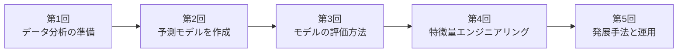
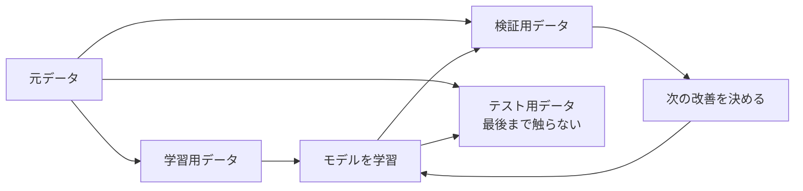
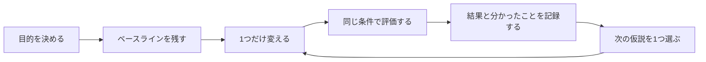

# 全5回の進め方

Notebookは「基本」と「演習」から進めます。詳しくは[README「Notebookの進め方」](../README.md#notebookの進め方)を参照してください。

## この勉強会で大切にすること

- 毎回、説明より先に何かを動かす
- 正解より「何を変えたら何が起きたか」を話す
- 初心者はスターターコードを変更し、経験者は別案を試す
- 各回は「1つのML知識」を軸にした構成。前の回の知識を土台に、次の回へ積み上がる
- 自習していない週があっても、次回から普通に参加できる
- アルゴリズムの暗記より、予測時点・評価・比較・失敗例を大切にする
- M365 Copilotは、説明、変更、デバッグ、レビューの相棒として毎回使う

## 全5回とその内訳

この勉強会は**全5回**です。各回は3つのパート（第1回のみ4つ）に分かれます。

| 回 | テーマ | パート |
|---:|---|---|
| 1 | データ分析の準備 | 環境とuv・Git／Python基礎／pandas／EDA |
| 2 | 予測モデルを作成 | 問題設定／回帰／モデル比較 |
| 3 | モデルの評価方法 | 検証・リーク／分類の評価／改善実験 |
| 4 | 特徴量エンジニアリングの紹介 | Pipeline化／特徴量を作る／特徴量を選ぶ |
| 5 | 転移学習・再学習・ニューラルネットワークモデルの紹介 | ニューラルネットワーク／転移学習／運用（永続化・監視・再学習） |

道具をそろえてから作り、作ったら正しく評価し、評価できるようになってから改善（特徴量）に進み、最後に発展的な手法と運用を知る、という積み上げの順番です。1回で全パートを終える必要はなく、パート単位で数回に分けて進めても構いません。

「各回の詳細」は、各回をパートごとに説明します。「発展内容の一覧」は、**行1つが1パート**に対応します。

## 1パート（90分）の基本形

各回は3パート（第1回のみ4パート）あるため、実際には**1パートを1コマ（約90分）**として、複数コマに分けて進めます。下表は1パート分の基本形です。

| 時間 | 内容 |
|---:|---|
| 10分 | 前パートの面白かった結果を振り返る |
| 15分 | このパートの問いを共有する |
| 20分 | 講師のライブ実演 |
| 30分 | `演習`と`変更して確認`を試す |
| 10分 | 参加者の結果を並べて話す |
| 5分 | 次パート予告と任意の`自由課題（任意）` |

## 90分で扱う範囲

同期回では「基本」と「演習」を進め、全員が同じ出力を確認するところまでを目安にします。
時間が余った場合は「変更して確認」を1つ試します。「発展（任意）」「追加演習（任意）」
「自由課題（任意）」は自習用で、終えていなくても次のパートへ進めます。

## 発展内容の一覧

この表は経験者向けの発展メニューの一覧なので、専門用語が多く登場します。分からない言葉があっても心配ありません。実際に扱う回のNotebook内で、そのつど説明します。

「通し番号」は全パートを上から順に数えた番号です。1〜4が第1回、5〜7が第2回という順で対応します。

| 通し番号 | 同期回で扱う内容 | 発展内容（任意） |
|---:|---|---|
| 1 | Python環境・uv・Gitの基礎、ライブラリのバージョン確認 | Gitでの共同作業（ブランチ・PR）、`pyproject.toml`を読む |
| 2 | 型ヒント・docstring付き関数を読み書きする | 防御的関数、assertテスト、IQR外れ値除去、冪等性の調査 |
| 3 | 健康診断・`query`・`groupby`で集計 | `pivot_table`、`pipe`、apply対ベクトル化の速度比較 |
| 4 | 分布・欠損・外れ値を可視化 | 相関対相互情報量、欠損機構（MCAR/MAR）、`IsolationForest`の多変量外れ値 |
| 5 | 予測問題とDummyを定義、リーク監査関数 | コスト行列と期待コスト最小の閾値、指標を意思決定から逆算 |
| 6 | 回帰4モデルを交差検証で比較 | 学習曲線、群別残差、分位点回帰の予測区間と被覆率 |
| 7 | 5モデルを同条件・交差検証で比較 | 反復CVとWilcoxon検定、投票・スタッキング、任意でXGBoost |
| 8 | 前処理を分割の内側へ、系列分割 | KFold/Stratified/Group比較、ネストCV、adversarial validation |
| 9 | 混同行列・閾値・PR-AUC・Logloss | 確率の較正（信頼度図・Brier）、コスト最適閾値、`class_weight` |
| 10 | 1要素ずつ改善を記録 | `RandomizedSearchCV`、ネストCVの楽観の少ない推定、重要度の信頼区間 |
| 11 | 前処理をPipeline化、変換後の列名確認 | 自作変換器（`BaseEstimator`）、前処理の`GridSearchCV`探索 |
| 12 | 仮説特徴量の交差検証アブレーション、RDKit記述子 | 相互情報量選択、多項式・ビニング特徴量 |
| 13 | リーク安全なOOF target encoding、RFECV | 特徴量選択の解釈、並べ替え重要度の再確認 |
| 14 | MLPと既存モデルを同条件で比較 | 隠れ層・活性化関数・正則化・solverの比較 |
| 15 | 転移学習の考え方と実例 | 事前学習済みモデルを探す観点 |
| 16 | 永続化・サービング・モデルカード | 適用領域、ドリフト検知の模擬 |

右列は全員必修ではありません。講師は参加者の反応を見て1〜2個だけ同期回で扱い、残りを任意自習へ回します。

## 各回の詳細

### 第1回：データ分析の準備

#### パート1：Python環境とuv、Gitの基礎

**今日の問い**：自分のパソコンで、なぜ同じPythonの環境を再現できるのか。

- 仮想環境（プロジェクトごとに分けたPython環境）とは何かを知る
- `sys.executable`で、今動いているPythonの場所を確認する
- `uv`が何をしているか、Condaとの違いを知る
- `importlib.metadata`でライブラリのバージョンを確認する
- Gitの基本用語（リポジトリ・コミット・クローン・プル・プッシュ・ブランチ）を知る（操作は任意）

#### パート2：Pythonを読み、Copilotと少し変える

**今日の問い**：分からないコードを、どうやって小さく理解するか。

- 変数、リスト、辞書、`if`、`for`、関数、`import`を読む
- Notebookの実行順と変数の状態を確認する
- Copilotにコードを行ごとに説明させる
- 既存コードを壊さず、変更を1つだけ依頼する
- エラー全文を渡して、原因候補と最小修正を聞く

文法を網羅せず、以後の分析で頻繁に現れる形へ絞ります。

#### パート3：pandasで表データに触る

**今日の問い**：初めて見る表データを受け取ったら、最初に何を見るか。

- CSVを`DataFrame`として読み込む
- `head`、`shape`、`dtypes`、`describe`を使う
- 行と列を選択する
- 条件で絞り込み、集計する
- データ型と欠損値を確認する

5人がそれぞれ違う列を担当し、「この列は何を表していそうか」を共有します。

#### パート4：分布・欠損・外れ値を確認する

**今日の問い**：モデルを作る前に、データの怪しいところをどう見つけるか。

- ヒストグラム、散布図、箱ひげ図、カテゴリ別集計を作る
- 欠損の量と発生パターンを見る
- 外れ値を「削除対象」と即断しない
- 可視化から仮説を1つ作る
- Copilotにグラフ案を出させ、実際の図と照合する

### 第2回：予測モデルを作成

#### パート1：何を、いつ、何のために予測するか

**今日の問い**：モデル構築より前に決めるべきことは何か。

- 目的変数と説明変数を決める
- 予測を行う時点を決める
- 回帰・分類の違いを整理する
- 最頻値や平均値を使う単純なベースラインを作る
- 「良いスコア」ではなく、予測をどう使うかを考える

化学研究の例を使い、測定前には得られない列を洗い出します（データリーク）。

#### パート2：数値を予測する—回帰

**今日の問い**：連続値の予測モデルを、何と比べ、不確かさをどう示すか。

- `DummyRegressor`、線形回帰、決定木、Random Forestを比較する
- MAE、RMSE、R²を直感的に読む
- 予測値と実測値、残差を可視化する
- 大きく外した試料を調べる
- Copilotにモデル比較表を作らせ、数値を自分で確認する

#### パート3：複数のモデルを同じ条件で比較する

**今日の問い**：複雑なモデルは本当にいつも優れているか。

- 分類モデル（Dummy・ロジスティック回帰・決定木・Random Forest・勾配ブースティング）を同じ分割・同じ指標で比較する
- 訓練時間、スコア、説明しやすさを並べる
- モデル名だけでなく、失敗例から次の一手を考える

### 第3回：モデルの評価方法

#### パート1：モデルは本当に当たっているか

**今日の問い**：手元のスコアをどこまで信じてよいか。

- 学習データと検証データを分ける
- 学習データ上の高得点を体験する
- 木の深さを変え、過学習と未学習を見る
- 前処理前に分割する意味を知る
- 実験日、バッチ、化合物系列などを意識した分割を考える

検証用データは改善の判断に使い、テスト用データは最後の確認まで閉じておきます。

#### パート2：クラスを予測する—分類

**今日の問い**：正解率だけで十分なのはどんなときか。

- 混同行列を読む
- 適合率、再現率、F1を使い分ける
- 閾値を変えると判定がどう変わるかを見る
- **AUCとLoglossの違い**を知り、使い分ける
- 確率の較正（信頼度図・Brierスコア）を確認する

#### パート3：改善実験を1つずつ行う

**今日の問い**：改善した理由を後から説明できる実験とは何か。

- 交差検証でスコアのばらつきを見る
- 一度に変更する要素を1つにする
- パラメータを少数候補で比較する
- 実験名、変更点、結果、分かったことを表に残す
- permutation importanceとエラー分析から次の仮説を作る

### 第4回：特徴量エンジニアリングの紹介

#### パート1：前処理をPipelineにまとめる

**今日の問い**：数値列とカテゴリ列を、安全に同じモデルへ入れるにはどうするか。

- 欠損補完、標準化、One-Hot Encodingを試す
- `ColumnTransformer`で列ごとの処理を分ける
- `Pipeline`で前処理とモデルをまとめる
- Pipelineがデータリーク防止に役立つ理由を確認する
- 未知カテゴリを含むデータで予測する

#### パート2：特徴量を作る

**今日の問い**：研究者の知識を、モデルへ渡せる形にするにはどうするか。

- 元の列から比、差、合計、カテゴリを作る
- 特徴量を作る前後で同じ検証を行う
- 化合物例ではSMILESから分子量、LogP、TPSAなどを計算する
- RDKit記述子を「意味のある測定・計算値」として読む

RDKitは発展扱いとし、初学者は計算済み記述子の表を使います。

#### パート3：特徴量を選ぶ

**今日の問い**：作った特徴量は、本当に信頼して使ってよいか。

- リークを避けたtarget encoding（OOF）を分割の内側で自作する
- `RFECV`で交差検証つきに特徴量を絞り込む
- 交互作用特徴量・ビニングを試す
- 並べ替え重要度で、作った特徴量の効き目を確かめる

### 第5回：転移学習・再学習・ニューラルネットワークモデルの紹介

#### パート1：ニューラルネットワークを試す

**今日の問い**：複雑なモデルは、このデータでも必ず勝つのか。

- `MLPClassifier`（ニューラルネットワーク）を、既存のRandom Forestと同条件で比較する
- 標準化（StandardScaler）が必須である理由を確認する
- Dummy・ロジスティック回帰ともベースライン比較する
- 隠れ層のユニット数・活性化関数・正則化・solverを変えて挙動を見る
- 420行程度の表データでは、複雑なモデルが必ず勝つとは限らないことを確かめる

#### パート2：転移学習を知る

**今日の問い**：少ないデータしかないとき、他所で学んだ知識を借りられないか。

- 事前学習・ファインチューニングの考え方を知る
- この教材のデータで転移学習を使いにくい理由を理解する
- 化学・創薬分野での実例（分子表現学習、画像スクリーニングなど）を知る
- 事前学習済みモデルを検討する3つの観点（領域の近さ・データ形式・ライセンス）を知る

この回はコードを書かず、考え方と実例を知ることに絞ります。

#### パート3：モデルを運用する（永続化・監視・再学習）

**今日の問い**：モデルを「作って終わり」にしないために、運用で何をするか。

- モデルは **学習 → 提供（サービング）→ 監視 → 再学習** のループで価値を出す、という視点を持つ
- `joblib`で学習済みPipelineを保存し、読み直しても同じ予測になることを確認する
- 保存済みPipelineを読み込み、予測を返す「推論関数」を用意する（サービングの最小形）
- モデルカード（用途・限界・禁止条件）を関数で生成する
- 入力ドリフト・予測傾向・性能・適用領域を監視項目にする
- 再学習のトリガーを決め、同じ検証・同じ評価で旧モデルと比較してから入れ替える

## 自習の扱い

自習は任意です。各回の`演習`までを同期回で完了し、`変更して確認`と`自由課題（任意）`を自習候補にします。次回は自習結果を前提に進めません。

## Kaggleを試したい場合

この勉強会の本編にKaggleコンペの模擬演習は含まれていません。実際のKaggleコンペで手順を試したい場合は、第5回フォルダにある任意教材 [titanic_optional.ipynb](../lessons/05-advanced-and-operate/titanic_optional.ipynb)（[ガイド](kaggle-titanic-guide.md)）を使います。
