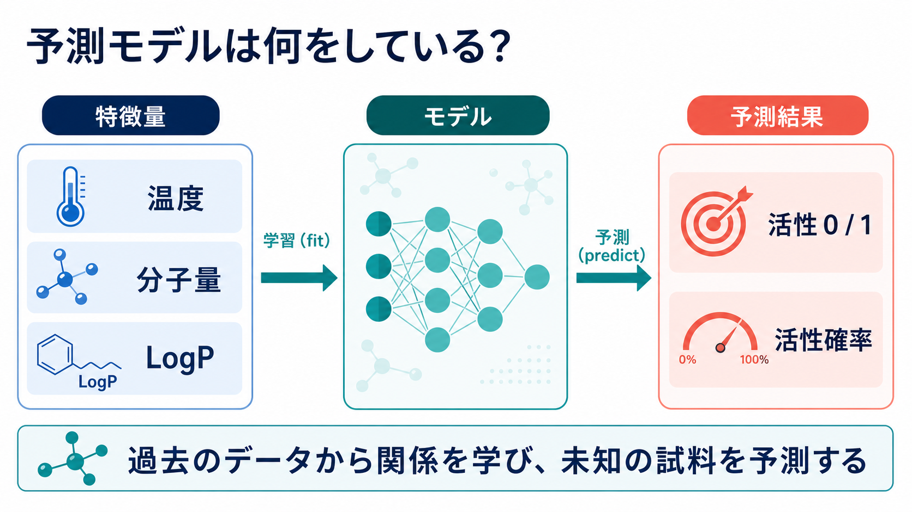

# 第1回：予測モデルを動かしてみる

**今日の問い**：予測モデルは、データを受け取って何を返しているのか。

## この回の深掘り

- `CORE`：特徴量からクラスと活性確率を予測する
- `DEEP DIVE`：予測確率の分布と特徴量重要度を読み、1試料だけで判断しない
- `SELF-STUDY`：木の深さ2・4・8を同じ検証データで比較する



`fit`では過去データから関係を学び、`predict`では学習済みモデルへ未知の試料を渡します。第1回はアルゴリズムの中身より、どの情報を入れて何が返ってくるかを見ます。

## 90分

- 10分：勉強会とリポジトリを案内する
- 20分：ZIP展開、`uv sync`、環境チェック
- 15分：完成済みNotebookを講師が実行する
- 30分：`TRY` 入力値とモデル設定を1つ変える
- 10分：5人の予測結果を並べる
- 5分：学習、予測、特徴量、目的変数を振り返る

## ASK COPILOT

```text
以下のscikit-learnコードで、fitとpredictがそれぞれ何をしているか、
料理以外の身近な比喩を使って初心者向けに説明してください。
```

既存教材は[教材候補一覧](../../docs/resources.md#第1回予測モデルを動かしてみる)を参照します。

実習は[lesson.ipynb](lesson.ipynb)を使います。
