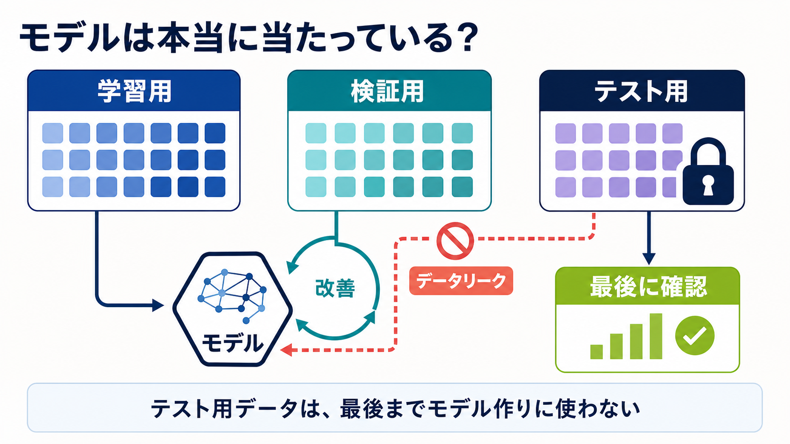
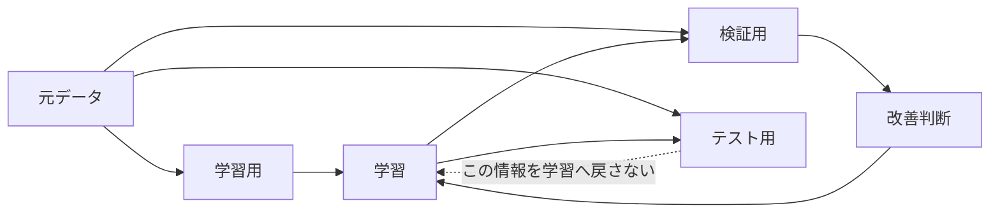

# 第6回：モデルは本当に当たっているか

**今日の問い**：手元のスコアをどこまで信じてよいか。

## この回の深掘り

- `CORE`：学習・検証の差とリーク列による不自然な高得点を見る
- `DEEP DIVE`：`GroupKFold`で化合物系列を跨がせず、F1の平均とばらつきを測る
- `SELF-STUDY`：自社データで分割単位にすべき候補を3つ挙げる



青・緑の経路が正しい評価の流れです。赤い近道のように、テスト用データや予測時点では得られない情報がモデル作りへ混ざると、手元の点数だけが不自然に良くなることがあります。



## 90分

- 10分：学習データ上で100点のモデルを見る
- 20分：train、validation、testの役割を整理する
- 25分：`TRY` 木の深さと学習・検証スコアを比較する
- 20分：リーク入りNotebookから問題を探す
- 10分：バッチ・日付・系列での分割を考える
- 5分：リーク発見チェックを残す

## ASK COPILOT

```text
以下の分析手順でデータリークが起きる可能性を確認してください。
予測時点で利用可能か、分割前に学習していないか、同じ系列が跨っていないか、
という3点でレビューしてください。
```

既存教材は[教材候補一覧](../../docs/resources.md#第6回モデルは本当に当たっているか)を参照します。
