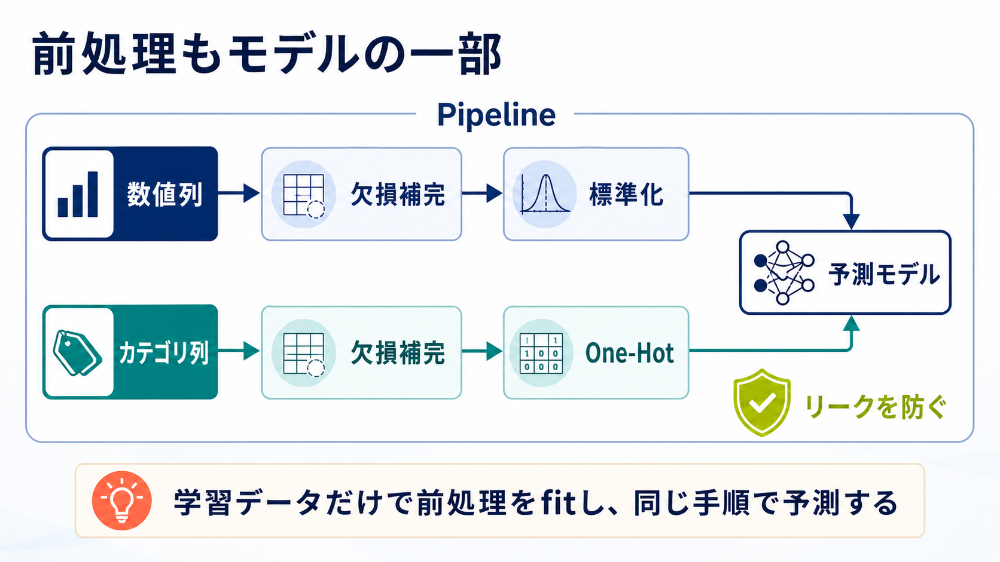

# 第9回：前処理をPipelineにまとめる

**今日の問い**：数値列とカテゴリ列を、安全に同じモデルへ入れるにはどうするか。



Pipelineに入れることで、欠損補完や標準化も「学習データだけで`fit`する処理」としてモデルと一緒に管理できます。

## 90分

- 10分：モデルがそのまま読めない値を探す
- 20分：欠損補完、標準化、One-Hot Encodingを実演する
- 25分：`TRY` `ColumnTransformer`を組み立てる
- 20分：Pipelineで前処理とモデルを接続する
- 10分：未知カテゴリを入れて予測する
- 5分：Pipelineの中身を言葉にする

## ASK COPILOT

```text
以下のDataFrameの列を、数値列とカテゴリ列に分け、
欠損補完とOne-Hot Encodingを含むColumnTransformer案を示してください。
各処理が必要な理由も説明してください。
```

既存教材は[教材候補一覧](../../docs/resources.md#第9回前処理をpipelineにまとめる)を参照します。

実習は[lesson.ipynb](lesson.ipynb)を使います。
